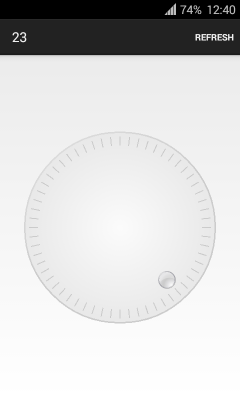

circle-timer-widget
===================

Round timer widget for Android.

## Usage

xml:

    <?xml version="1.0" encoding="utf-8"?>
    <com.github.lassana.circletimerwidget.widget.CircleTimerWidget
        xmlns:android="http://schemas.android.com/apk/res/android"
        xmlns:app="http://schemas.android.com/apk/res-auto"
        app:widget_color="#33515151"
        app:widget_color_start="#33CCCCCC"
        app:widget_color_end="#CCCCCC"
        app:widget_color_center="#fffbfbfb"
        app:widget_color_edge="#e8e8e8"
        app:circle_width="2dp"
        app:separates_count="60"
        app:separator_length="12dp"
        app:indicator_drawable="@drawable/circle_grey"
        android:layout_gravity="center"
        android:id="@+id/circle"
        android:layout_margin="32dp"
        android:layout_width="match_parent"
        android:layout_height="match_parent"/>
    
code:

    circleTimerWidget.setCircleWidgetCallback(new CircleTimerWidget.CircleWidgetCallback() {
        @Override
        public void onZoneChanged(int indicatorZone) {
            // ...
        }
    });

---

This project is licensed under [the FreeBSD License](LICENSE).
