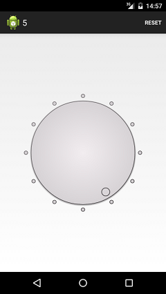
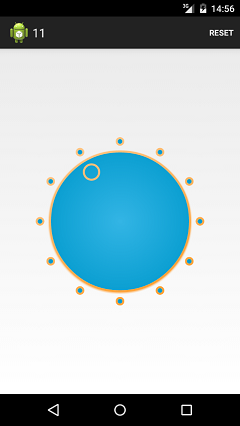
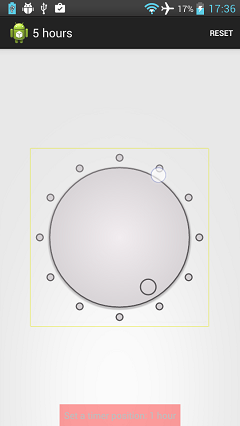
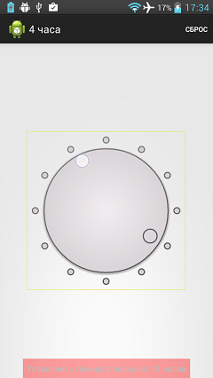

circle-timer-widget
===================

Round timer widget for Android without any PNG.

 

The widget supports localized accessibility events:

 

## Usage

Grab the latest version from `jcenter`:

    repositories {
        jcenter()
    }
    dependencies {
        compile 'com.github.lassana:circle-timer-widget:1.1.0'
    }

XML:

    <com.github.lassana.circletimerwidget.widget.CircleTimerView
            android:id="@+id/circle"
            android:layout_width="match_parent"
            android:layout_height="match_parent"
            app:start_color="#FFDEBC"
            app:end_color="#ff8800"
            app:inner_color="#33b5e5"
            app:outer_color="#0099cc"
            app:circle_line_width="3dp"
            app:hitch_size="30dp"
            app:hitch_padding="20dp"
            app:hitch_count="12"
            app:indicator_size="33dp"
            app:indicator_padding="10dp"/>

An accessibility events messages (strings array) can be set in `android:entries` attribute:

    <com.github.lassana.circletimerwidget.widget.CircleTimerView
        android:layout_width="match_parent"
        android:layout_height="match_parent"
        ...
        android:entries="@array/timer_names"/>

Callback:

    circleTimerWidget.setCircleTimerListener(new CircleTimerListener() {
        @Override
        public void onPositionChanged(int newPosition) {
            // ...
        }
    });

---

This project is licensed under [the FreeBSD License](LICENSE).
