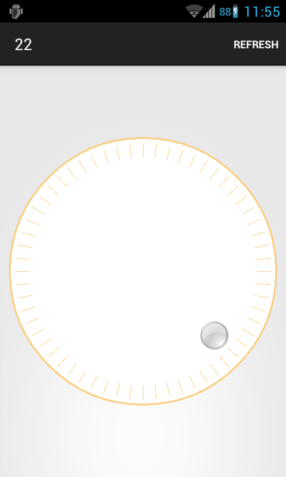

circle-timer-widget
===================

Round timer widget for Android.

## Usage

xml:

    <?xml version="1.0" encoding="utf-8"?>
    <LinearLayout xmlns:android="http://schemas.android.com/apk/res/android"
                  xmlns:app="http://schemas.android.com/apk/res-auto"
                  android:orientation="vertical"
                  android:weightSum="3"
                  android:gravity="center"
                  android:layout_width="match_parent"
                  android:layout_height="match_parent">
    
        <com.github.lassana.circletimerwidget.widget.CircleTimerWidget
                app:widget_color="#face80"
                app:circle_width="2dp"
                app:separates_count="60"
                app:separator_length="16dp"
                app:indicator_drawable="@drawable/circle_grey"
                android:id="@+id/circle"
                android:layout_margin="10dp"
                android:layout_weight="3"
                android:layout_width="match_parent"
                android:layout_height="0dip"/>
    
    </LinearLayout>
    
code:

    circleTimerWidget.setCircleWidgetCallback(new CircleTimerWidget.CircleWidgetCallback() {
        @Override
        public void onZoneChanged(int indicatorZone) {
            // ...
        }
    });

---

This project is licensed under [the FreeBSD License](LICENSE).
